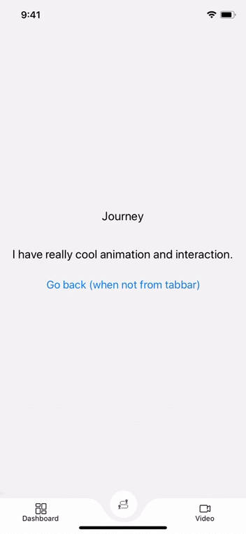
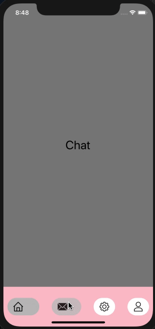

# Animating Bottom Bar



This library is designed to be fully compatible with popular react-navigation library and can be attached to `tabBarComponent` prop provided by BottomBarNavigation
This library uses `SVG` and `Lottie` library to render beautiful animation and support all the customization options you may require to best fit it for your use-case.

## Installation

### Current Version: 1.0.6

This library will follow `major.minor.patch-(navigation-version)` synax to support different version of react navigation.

For

React navigation 3 :- `1.0.6-3`

React navigation 4 :- `1.0.6-4`

React navigation 5 :- `To Be Implemented`

```
npm i react-native-animating-bottom-tab-bar@version
```

Apart from it you also need to install `Svg` and `Lottie` library

```
npm i react-native-svg
npm i lottie-react-native
npm i lottie-ios@3.1.3
```

**Note**: Right now I have tested this library with react-navigation@3.x and planning to release 4.x and 5.x compatible in a month or so.

## How to use it

**Step 1: Set up basic navigation bar with `react-navigation`**

```
const TabBar = createBottomTabNavigator({
  [RouteName.Home]: Home,
  [RouteName.Chat]: Chat,
  [RouteName.Setting]: Setting,
  [RouteName.Profile]: Profile,
});

const AppContainer = createAppContainer(TabBar);

```

**Step 2: Import `getAnimatingBottomBar`, `AnimationType` from `react-native-animating-bottom-tab-bar`**

```
import {getAnimatingBottomBar, AnimationType} from 'react-native-animating-bottom-tab-bar';
```

`getAnimatingBottomBar` function create a TabBar which you can directly passed to `createAppContainer()`. It accepts an object. Various supported property of the object are

- Animation Type (type)
- NavigationScreens (navigationScreens)
- NavigationParameter (navigationParameter)
- Object (configData) (Optional)

```
const BottomBarStack = getAnimatingBottomBar({
  type: AnimationType.ExpandingLabel,
  navigationScreens: NavigationScreens,
  navigationParameter: NavigationParameter,
  configData: {
    bottomBarConfig,
    extraTabs,
  },
});
```

**Step 3: Pass result of `getAnimatingBottomBar` to `createAppContainer`**

```
const AppContainer = createAppContainer(BottomBarStack);

```

## _getAnimatingBottomBar_ params

##### NavigationScreens

This parameter is an object in which we specify our Component(screen) correspoding to a route or simply first argument we passed in `createBottomTabNavigator`
while setting up our basic navigation without any navigation options.

```
const NavigationScreens = {
  [RouteName.Home]: Home,
  [RouteName.Chat]: Chat,
  [RouteName.Setting]: Setting,
  [RouteName.Profile]: Profile,
};

```

##### NavigationParameter

This argument is an array to specify argument to be used by individual tab. For example, in the `NavigationScreens`, we have 4 routes defined so we will also create an array of 4 object for NavigationParameter -- 1 for each tab in the same order.

```
const NavigationParameter = [
  {
    label: RouteName.Home,
    routeName: RouteName.Home,
    icons: TabBarIcons.Home,
  },

  {
    label: RouteName.Chat,
    routeName: RouteName.Chat,
    icons: TabBarIcons.Conversation,
  },

  {
    label: RouteName.Setting,
    routeName: RouteName.Setting,
    icons: TabBarIcons.HealthCard,
  },

  {
    label: RouteName.Profile,
    routeName: RouteName.Profile,
    icons: TabBarIcons.Timeline,
  },
];

```

#### Object

This argument is used to pass any extra configuration data like bottom bar background color or height of bottom bar. It support one basic property `bottomBarConfig`. `bottomBarConfig` is used to customize bottom bar.
Various property available are :-

| Property        | Description                                                          | Default |
| --------------- | -------------------------------------------------------------------- | ------- |
| backgroundColor | Background color of the bottom bar and circular selected view in tab | white   |
| height          | Height of the bottom bar                                             | 100     |

```
const bottomBarConfig = {
  backgroundColor: 'pink',
  height: 100,
};


...

const BottomBarStack = getAnimatingBottomBar({
  type: AnimationType.ExpandingLabel,
  navigationScreens: NavigationScreens,
  navigationParameter: NavigationParameter,
  configData: {
    bottomBarConfig,
  },
});

```

#### Various Animation Type

- SvgBottomBar
- ExpandingLabel

# 1. SvgBottomBar

1. Pass `AnimatonType.SvgBottomBar` in type property of the argument of _getAnimatingBottomBar_

**Various navigation property supported are**

| Property          | Description                                                          | Default                            |
| ----------------- | -------------------------------------------------------------------- | ---------------------------------- |
| label             | Title of the tabbar                                                  | empty                              |
| icons             | Object of active and inactive icons                                  | {selected: null, unselected: null} |
| route             | Route to navigate to                                                 | null                               |
| activeTintColor   | Tint color when tab is selected                                      | null                               |
| inactiveTintColor | Tint color when tab is not selected                                  | null                               |
| activeTextStyle   | Label style when tab is selected                                     | null                               |
| inactiveTextStyle | Label style when tab is not selected                                 | null                               |
| activeIconScale   | Image scale when tab is selected. Image scale is 1 when not selected | 1                                  |
| yTranslation      | Image translation from its initial position when tab is selected     | 28                                 |
| lottieSource      | Animation file                                                       | null                               |
| isLottieTab       | Enabling Lottie tab                                                  | false                              |

##### Object

It only accepts one property `configData`. Various property of `configData` available are :-

| Property                          | Description                                                                                                                                       | Default |
| --------------------------------- | ------------------------------------------------------------------------------------------------------------------------------------------------- | ------- |
| backgroundColor                   | Background color of the bottom bar and circular selected view in tab                                                                              | white   |
| height                            | Height of the bottom bar                                                                                                                          | 100     |
| initialRouteName                  | Initially selected route                                                                                                                          | null    |
| bottom                            | Bottom padding of the tabbar content. It don't change height of the bottom bar nor it create any distance between bottom of the screen and tabbar | 0       |
| curveWidth                        | Total width of the curve of the selected tab                                                                                                      | 82      |
| curveDepth                        | Depth of the curve. Deeper the curve steeper the curve will be                                                                                    | 43      |
| animationDuration                 | Animation duration of the slide animation in milliseconds                                                                                         | 400     |
| tabCircleDiameter                 | Diameter of the circular shape behind selected tab. Common for all tabs                                                                           | 44      |
| extraMarginBetweenTabIconAndLabel | Margin between tab icon and tab label                                                                                                             | 0       |

# 2. ExpandingLabel



1. Pass `AnimatonType.ExpandingLabel` in type property of the argument of _getAnimatingBottomBar_

**Various navigation property supported are**

| Property          | Description                          | Default                            |
| ----------------- | ------------------------------------ | ---------------------------------- |
| label             | Title of the tabbar                  | empty                              |
| icons             | Object of active and inactive icons  | {selected: null, unselected: null} |
| route             | Route to navigate to                 | null                               |
| activeBGColor     | Background when tab is selected      | white                              |
| inactiveBGColor   | Background when tab is not selected  | white                              |
| activeTintColor   | Tint color when tab is selected      | null                               |
| inactiveTintColor | Tint color when tab is not selected  | null                               |
| activeTextStyle   | Label style when tab is selected     | null                               |
| inactiveTextStyle | Label style when tab is not selected | null                               |
| lottieSource      | Animation file                       | null                               |
| isLottieTab       | Enabling Lottie Tab                  | false                              |

##### Object

It only accepts one property `configData`. Various property of `configData` available are :-

| Property                   | Description                                                          | Default |
| -------------------------- | -------------------------------------------------------------------- | ------- |
| backgroundColor            | Background color of the bottom bar and circular selected view in tab | white   |
| height                     | Height of the bottom bar                                             | 100     |
| initialRouteName           | Initially selected route                                             | null    |
| animationDuration          | Animation duration of the slide animation in milliseconds            | 400     |
| labelMarginLeft            | margin between label and icon                                        | 10      |
| containerHorizontalPadding | Horizontal padding of the tab container                              | 10      |
| containerVerticalPadding   | Vertical padding of the tab container                                | 10      |
